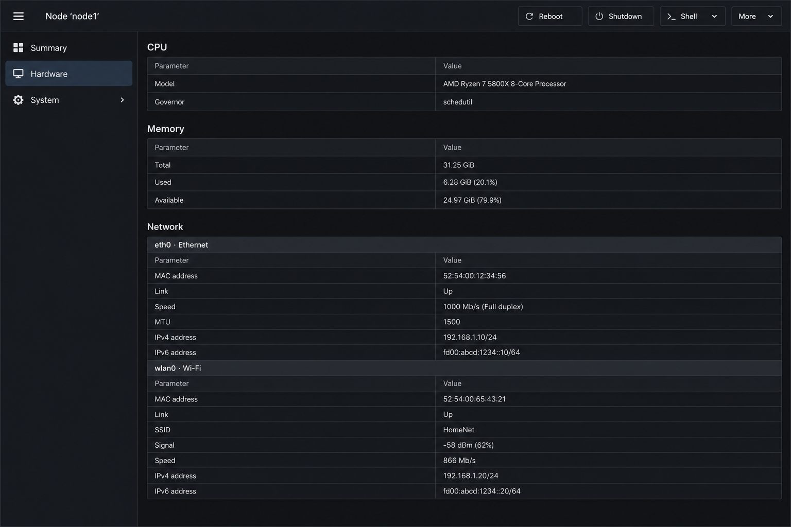
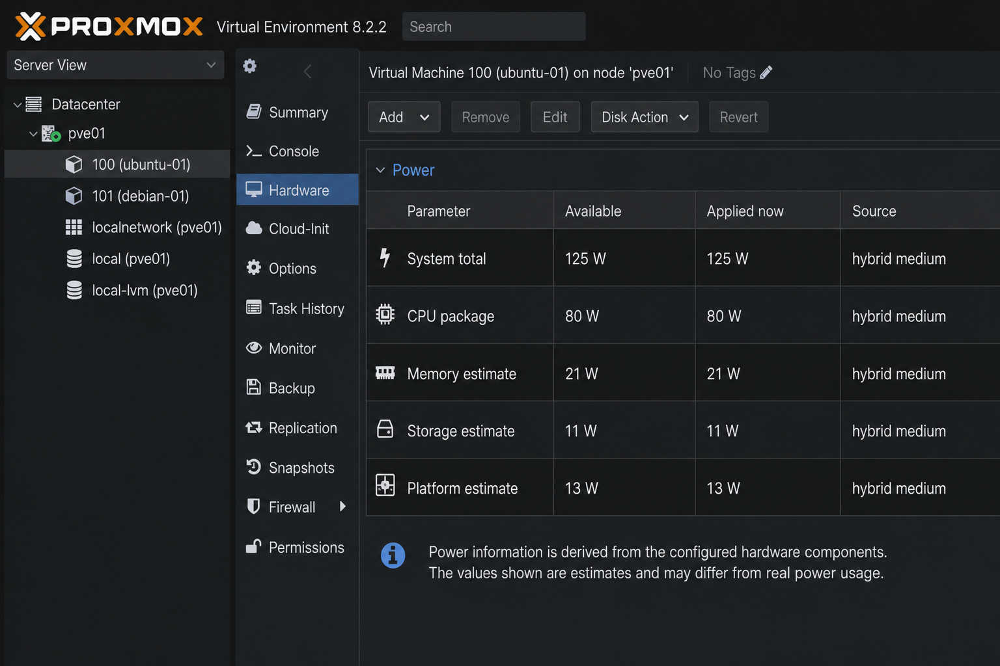
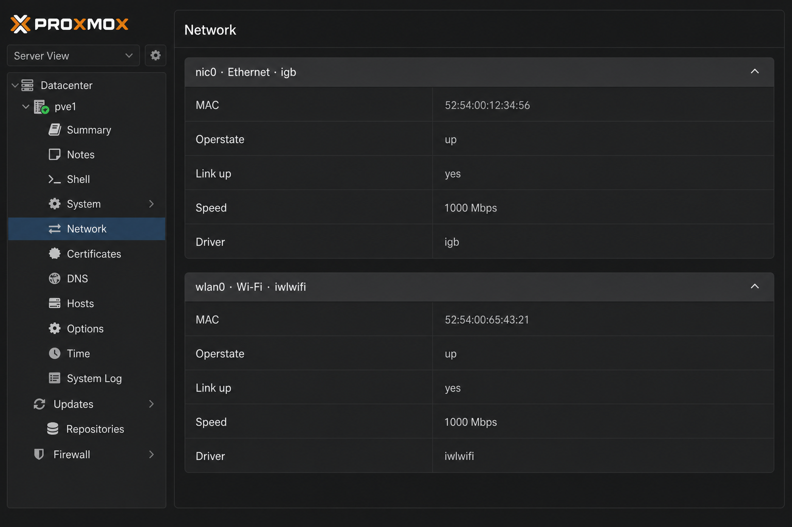

# Proxmox Node Hardware API

Hardware inventory and CPU control for **Proxmox VE 9.x** via the native PVE API (`:8006`).

[](https://github.com/mrkvka/proxmox-cpu-dashboard/actions/workflows/ci.yml)
[](https://github.com/mrkvka/proxmox-cpu-dashboard/releases)

Two installable components:

| Package | Purpose |
|---------|---------|
| **proxmox-node-hw-api** | `/nodes/{node}/hw*` JSON API — for scripts, monitoring, Home Assistant, etc. |
| **proxmox-node-hw-ui** | **Node → Hardware** tab in the web UI (requires API package) |

**Version:** [`VERSION`](VERSION) · **Latest release:** [GitHub Releases](https://github.com/mrkvka/proxmox-cpu-dashboard/releases) · **API:** [docs/API.md](docs/API.md) · **UI plugin:** [docs/PLUGIN.md](docs/PLUGIN.md)

## Screenshots

**Node → Hardware** — live inventory (CPU, memory, storage, platform, sensors, power):



**System power** — measured RAPL / hybrid / estimated total:



**Network** — all interfaces in one section with subgroups (Ethernet, Wi‑Fi, …):



## Quick install

### From GitHub Release (.deb)

Download **both** `.deb` files from [Releases](https://github.com/mrkvka/proxmox-cpu-dashboard/releases) (same version):

```bash
dpkg -i proxmox-node-hw-api_*_all.deb
dpkg -i proxmox-node-hw-ui_*_all.deb    # optional — Hardware tab
pvesh get /nodes/$(hostname -s)/hw
```

Ctrl+Shift+R in the browser after UI install.

### From git

**API only** (automation / external clients):

```bash
git clone https://github.com/mrkvka/proxmox-cpu-dashboard.git
cd proxmox-cpu-dashboard
bash install-api.sh
pvesh get /nodes/$(hostname -s)/hw
```

**API + UI** (full experience):

```bash
bash install-api.sh
bash install-ui.sh
# or: bash install.sh
```

### Build .deb locally

```bash
make deb
dpkg -i dist/proxmox-node-hw-api_*_all.deb dist/proxmox-node-hw-ui_*_all.deb
```

`proxmox-node-hw-ui` depends on the same version of `proxmox-node-hw-api`.

## Uninstall

```bash
bash uninstall-ui.sh    # first, if UI was installed
bash uninstall-api.sh
# or: bash uninstall.sh
```

## Paths on the host

| Path | Package |
|------|---------|
| `/usr/share/pve-node-hw-api/` | API scripts, docs, `VERSION` |
| `/usr/share/pve-node-hw-ui/` | UI JS sources |
| `/usr/local/bin/pve-hw-collect.py` | Collector |

## After `apt upgrade pve-manager`

```bash
bash install-api.sh
bash install-ui.sh   # if you use the tab
bash scripts/verify-patch.sh
```

See [UPGRADE.md](UPGRADE.md).

## Known limitations

- **PVE 9.x** — tested on 9.2; reinstall after `pve-manager` upgrades ([UPGRADE.md](UPGRADE.md)).
- **UI hook** — adds script tags to `index.html.tpl`; minimal `PVE.panel.Config` override ([PLUGIN.md](docs/PLUGIN.md)). Tab appears on **nodes only**, not VM/CT.
- **API hook** — small block in `Nodes.pm`; `install-api.sh` is idempotent.
- **Power** — `power.system_watts` is measured (RAPL) or **estimated**; not a substitute for PDU, IPMI, or smart PDU.
- **Permissions** — read needs `Sys.Audit`; CPU changes need `Sys.Modify` ([SECURITY.md](SECURITY.md)).
- **Home Assistant** — separate project: [ha-proxmox-cpu-ctl](https://github.com/mrkvka/ha-proxmox-cpu-ctl).

## Development

```bash
make test
make deb
```

[CONTRIBUTING.md](CONTRIBUTING.md) · [SECURITY.md](SECURITY.md) · [CHANGELOG.md](CHANGELOG.md) · [ROADMAP.md](docs/ROADMAP.md)

## License

MIT
